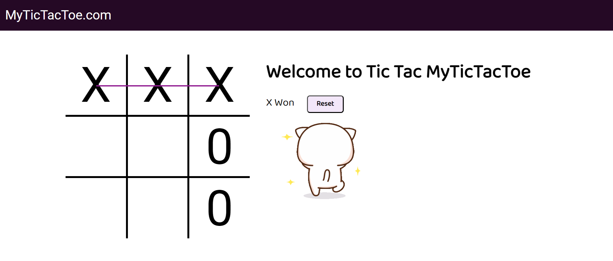

# Tic Tac Toe Game

A simple, interactive Tic Tac Toe game built with HTML, CSS, and JavaScript. This project is a web-based version of the classic two-player game where the objective is to get three marks in a row, either horizontally, vertically, or diagonally.

## Live Demo

Check out the live version of the game [here](https://tic-tac-toe-game-gilt.vercel.app/).


## Features

- **Responsive Design:** The game is designed to be responsive, ensuring it works well on devices of various sizes.
- **Interactive Gameplay:** Players take turns to place their marks (X or O) on the 3x3 grid.
- **Winner Detection:** The game automatically checks for a winner after each move and displays the result.
- **Game Reset:** A reset button allows players to start a new game without refreshing the page.
- **Winning Line Highlight:** The winning combination of marks is highlighted for clear visibility.

## Screenshot



## Technologies Used

- **HTML5:** Structuring the game layout.
- **CSS3:** Styling the game, including the grid, buttons, and animations.
- **JavaScript:** Handling the game logic, including player turns, win conditions, and game resets.

## Project Structure

- `index.html`: The main HTML file that contains the game structure.
- `style.css`: The CSS file for styling the game components.
- `script.js`: The JavaScript file that contains the game logic.
- `assets/`: A folder containing images and audio files used in the game.

## How to Play

1. Open the game in your web browser.
2. The game starts with Player X’s turn.
3. Click on an empty box to place your mark (X or O).
4. Players take turns until one player wins or the game ends in a draw.
5. If a player wins, the winning combination is highlighted and a message is displayed.
6. Use the "Reset" button to start a new game.

## How to Run the Project Locally

1. Clone the repository:
    ```bash
    git clone https://github.com/yourusername/tic-tac-toe.git
    ```
2. Navigate to the project directory:
    ```bash
    cd tic-tac-toe
    ```
3. Open `index.html` in your preferred web browser.

